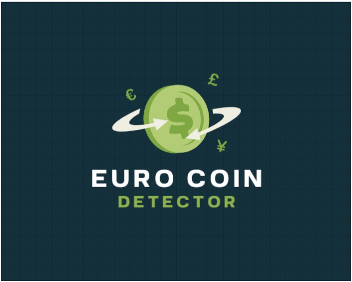

# Euro Coin Detector

# Description

> This module provide end-2-end Euro Coin Detector  
> All logic split into 2 pieces: training / evaluation ( detector )  
> Evaluation use CV2 library as source of data ( image / video / camera )  
> After evaluation next data is collected:  
> 1. Coin label
> 2. Coin silhouette ( radius / border box / coin square )
> 3. Coin cost
> 4. Total coins detected
> 5. Probability etc.

# Using 

| Module              | Description                           |
|---------------------|---------------------------------------|
| CNNImageDetector    | Run TensorFlow CNN model on Image     |
| CNNStreamDetector   | Run TensorFlow CNN model on WebCamera |
| HoughImageDetector  | Run CV2 on Image                      |
| HoughStreamDetector | Run CV2 on WebCamera                  |
| YOLOImageDetector   | Run YOLO model on Image               |
| YOLOStreamDetector  | Run YOLO model on Stream              |

# Models

> This block contains high-level info about models that are used 

| Model Name   | Accuracy         | Speed                    | Complexity                                       | Description                                                             |
|--------------|------------------|--------------------------|--------------------------------------------------|-------------------------------------------------------------------------|
| HoughCircles | &#x2B50;         | &#x2B50;&#x2B50;&#x2B50; | &#x2B50; ( no training, base tools in CV2 only ) | Can be used by real-time                                                |
| YOLO 12      | &#x2B50;&#x2B50; | &#x2B50;&#x2B50;         | &#x2B50;&#x2B50; ( GPU need for training )       | Work well on Stream, but better on images.                              |
| TF CNN       | &#x2B50;&#x2B50; | &#x2B50;                 |                                                  | Poor work on Stream ( freezing / halucinates ) but works fine on image. | 

## Improvements
> This block provide future improvements / weak sides that are need to fix etc.

Extend current dataset with next one: https://huggingface.co/datasets/3v3r51nc3/eurocoin-vision-dataset

### YOLO TODO:

1. ~~Try default implementation~~ - &#9989;
2. Read [official documentation](https://docs.ultralytics.com/usage/python/) and try use it 
3. ~~For predicted - change default path~~ - &#9989;
4. ~~For evaluation - use built-in implementation - to show image with labels~~ - &#9989;
5. ~~Add additional info ( Total Sum, Total Coins etc.)~~ - &#9989;
6. ~~Train YOLO on Kaggle with GPU ( 25 epochs - precision 0.5599 / recall - 0.66279)~~ - &#9989;
7. ~~Use EarlyStopping~~ - &#9989;

### CNN TODO:

1. ~~Find out dataset~~
2. ~~Create a folders 1_cent,2_cent,5_cent,20_cent,50_cent,1_euro,2_euro~~ - &#9989;
3. ~~Use TensorFlow Dataset to create a dataset with labels ( use load_from_folder function )~~ - &#9989;
4. Add more images ?

## Issues:

- YOLO:
- - Model miss 1 and 2 cents with 10 and 20 cents ( idk why )
- TF CNN:
- - Model cannot recognize coins that not 90 degrees to the camera ( add more images / change data augmentation )

## Training Datasets
> This block shows useful datasets that are can be used to train models

- [HuggingFace Dataset: coins-euro ](https://huggingface.co/datasets/photonsquid/coins-euro)
- [HuggingFace Dataset: eurocoin-vision-dataset](https://huggingface.co/datasets/3v3r51nc3/eurocoin-vision-dataset)
- [Kaggle Dataset: EURO coins dataset](https://www.kaggle.com/datasets/janstaffa/euro-coins-dataset)
- ~~[Kaggle Dataset: Eurocoins Images](https://www.kaggle.com/datasets/bastianberle/eurocoins-images-object-detection)~~ - Incorrect annotations !

## Recommended resources:
> All useful articles / manuals and other sources that are used

- [OpenCV Coin Detection in Python with Canny and Contours](https://eranfeit.net/easy-coin-detection-with-python-and-opencv/)
- [Blog: Eran Feit posts](https://eranfeit.net/blog/)
- [Kaggle Notebook: Euro Coins YOLO12 Train and Predict](https://www.kaggle.com/code/stpeteishii/euro-coins-yolo12-train-and-predict)
- [Kaggle Notebook: Euro Coins YOLO26 Train and Predict](https://www.kaggle.com/code/stpeteishii/euro-coins-yolo26-train-and-predict)

## YOLO Used Sources
- [YOLO Model Training](https://docs.ultralytics.com/modes/train/)
- [YOLO Model Prediction](https://docs.ultralytics.com/modes/predict/)
- [YOLO Official Manual](https://docs.ultralytics.com/usage/python/)
- [Kaggle Notebook: Euro Coins YOLO26 Train and Predict](https://www.kaggle.com/code/stpeteishii/euro-coins-yolo26-train-and-predict/notebook)